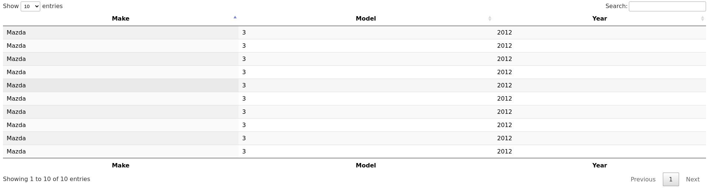

# TO USE
1. Install Django
2. Install djangorestframework
3. Start up Postgres server
4. Edit settings.py DATABASES variable with appropriate info
5. Generate and run migrations
6. `python manage.py runserver`
7. Navigate to `http://localhost:8000/cars/view_cars

## Screenshot
